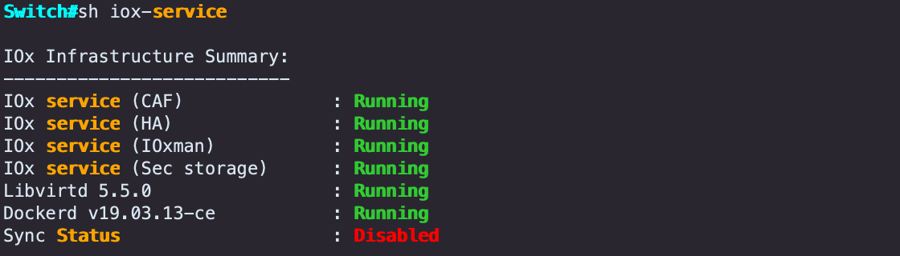
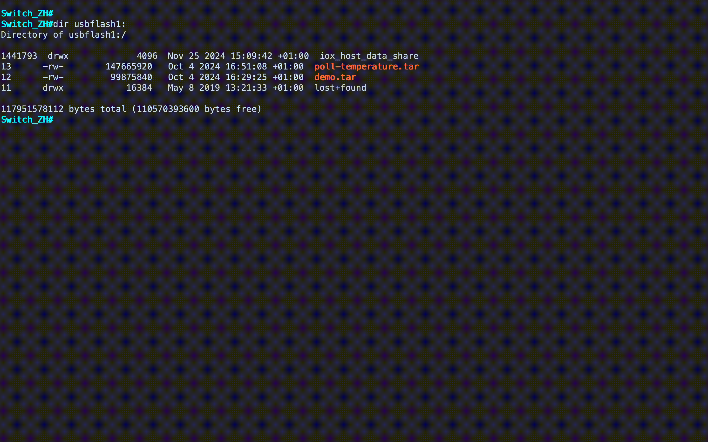

# Catalyst 9300 APP
This is a sample application that demonstrates a simple web server running on Cisco Catalyst 9300 switches.

Catalyst 9300 switches are based on an x86 architecture. To build a compatible iox app you need to build it on an x86_64 based system (e.g. on a Ubuntu server) or use cross compilation.

## Prerequisites

1. Make sure Docker is installed on your system. You can find installation instructions specific to your operating system on the Docker website.
2. (Optional) [Download ioxclient](https://developer.cisco.com/docs/iox/#!iox-resource-downloads).

> *Note*: This setup uses **Docker** version `24.0.5` and **ioxclient** version `1.17.0.0`. Using different versions may result in compatibility issues when packaging the Docker file using ioxclient (Step 4).

> *Note*: The `main.py` application implements two logging mechanisms:
> - **File Logging**: Logs are written to persistent storage using the `CAF_APP_LOG_DIR` environment variable (provided by the IOx framework). Logs can be accessed at `iox_data/logs/server.log` within the container.
> - **Syslog via Serial Port**: Log messages are also sent to the switch's syslog through the `/dev/ttyS2` serial interface, allowing integration with the switch's native logging system.\
      ```cisco
      Jan  5 12:33:33.281: %IM-5-IOX_INST_NOTICE: Switch 1 R0/0: ioxman: IOX SERVICE webapp LOG: Request from 10.0.0.103
      ```

## Step by Step deployment 

### Create your Application File

1. Download or clone this GitHub repository to your local machine.
2. Navigate to the directory containing the Dockerfile and run (on an x86_64 based architecuture). If sing arm-based environment, use simple cross-compilation build x86_64 compatible image `docker build --platform linux/amd64 -t c9300-web-app .`

   ```
   docker build -t c9300-web-app .
   ```
   To verify the the image, use:
   ```
   docker images
   ```
3. Export the image to a .tar file:
   ```
   docker save c9300-web-app:latest -o c9300-demo.tar
   ```

4. (Optional) You can use the `ioxclient` tool, to package the docker container with the `packacke.yaml` to add medatadata information or overwrite the allocated app resouces. To do so, run the following command  which will create the `package.tar` file that you can now deploy on your switch (instead of `c9300-demo.tar`). 
   ```
   ioxclient docker package c9300-web-app:latest ./conf
   ```

> *Note*: Unfortunately the `c9300-demo.tar` has more than 100 MB and cannot be uploaded to Github repository. On the other hand, it is the great opportunity to try docker commands :-)


### Set up the Infrastructure

1. Enter configuration mode and enable iox:

   ```cisco
   conf t
   iox
   ip http server
   end
   ```

   Verify the IOX service:
   ```cisco
   sh iox-service 
   ```

   

   Get info on any installed apps, use the `sh app-hosting ?` command.
2. Configure the `AppGigabitEthernet` interface to allow only traffic from the specified VLAN `<vlan_id>` to pass through. Note that the `AppGig` interface is only available on the Cisco Catalyst 9300 series, Catalyst 9400 series and Catalyst 9500X switches. 
   ```cisco
   conf t
   interface AppGigabitEthernet 1/0/1
   switchport trunk allowed vlan <vlan_id>
   switchport mode trunk  
   ```
3. (Optional) If you need to disable signed verification for app hosting, execute:

   ```cisco
   conf t
   no app-hosting signed-verification
   ```
   To verify if signed verification has been disbaled, use `sh app-hosting infra`.


### Install the Application

Select installation tool and deploy the app. In section below you find details for Cisco Catalyst Center and CLI.

#### Option 1: Install via Catalyst Center

1. In Catalyst Center, open *Provision > Services > Application Hosting*.
2. Click "New App" and upload the `c9300-demo.tar` file.
3. Select the uploaded app, click "Install," and follow the installation wizard.


> *Note*: Find more information and a detailed guide in the [Catalyst Center End User Guide](https://www.cisco.com/c/en/us/td/docs/cloud-systems-management/network-automation-and-management/catalyst-center/2-3-7/user_guide/b_cisco_catalyst_center_user_guide_237/b_cisco_dna_center_ug_2_3_7_chapter_01111.html?bookSearch=true#id_132431).

#### Option 2: Install via CLI

1. Copy the `c9300-demo.tar` file to the SSD (usfblash1) of your Switch. Then, verify the successful upload:
   ```cisco
   copy scp://<user>@<serverIP>://<path>/c9300-demo.tar usbflash1:/
   dir usbflash1:
   ```

2. Set up the interface for the application. In this example, the app is connected to a specific VLAN, and a single vNIC receives an IP address via DHCP. The `<guest-interface-number>` represents the Ethernet interface number inside the container (e.g., `eth0` if the value is set to 0):
   ```cisco
   conf t
   app-hosting appid webapp 
   app-vnic AppGigabitEthernet trunk 
   vlan <vlan_id> guest-interface <guest-interface-number> 
   end
   ```
3. Install the application using the command  `app-hosting install appid <app-name> package usbflash1:<docker-tar-file>`. E.g.:
   ```cisco
   app-hosting install appid webapp package usbflash1:c9300-demo.tar
   ```
4. Activate and Start the the application
   ```cisco
   app-hosting activate appid webapp 
   app-hosting start appid webapp 
   ```


> *Note*: More detailed information you can find [here](https://developer.cisco.com/docs/app-hosting/#!getting-cat9k-setup). There is much more examples including details, such as networking configuration.



**Verify and Test the app**

1. To Verify the installed apps and an app status, use:

   ```cisco
   sh app-hosting list
   sh app-hosting detail appid webapp 
   ```
2. Connect to the app

   ```cisco
   app-hosting connect appid webapp session   
   ```
   
3. To view the app logs from within the container (after connecting via session):
   ```cisco
   / # cat iox_data/logs/server.log 
   Setting up logging to file /iox_data/logs/server.log
   Server running at http://0.0.0.0:8000/
   Request from 10.0.0.103
   Syslog message sent successfully
   Response sent..
   ```
**Stop and Remove app**

1. Stop, remove and uninstall the app:
   ```cisco
   app-hosting stop appid webapp
   app-hosting deactivate appid webapp
   app-hosting uninstall appid webapp
   ```
2. Remove the app-hosting webapp
   ```cisco
   conf t
   no app-hosting appid webapp   
   ```


---
## Useful Resources  

- [Cisco Developer Documentation - Application Hosting](https://developer.cisco.com/docs/app-hosting/#!getting-cat9k-setup)  
  Comprehensive guide on application hosting, including setup, configuration, and examples.  

- [Application Hosting on the Cisco Catalyst 9000 Series Switches White paper](https://www.cisco.com/c/en/us/products/collateral/switches/catalyst-9300-series-switches/white-paper-c11-742415.html)  
  Detailed insights and technical information about AppHosting on Cisco Catalyst 9000 Series Switches. 

- [Programmability Configuration Guide, Cisco IOS XE Dublin 17.12.x](https://www.cisco.com/c/en/us/td/docs/ios-xml/ios/prog/configuration/1712/b_1712_programmability_cg/m_1712_prog_app_hosting.html)  
  A detailed guide on programmability and application hosting for Cisco IOS XE Dublin 17.12.x.  

- [Application Hosting (Catalyst Center End User Guide)](https://www.cisco.com/c/en/us/td/docs/cloud-systems-management/network-automation-and-management/catalyst-center/2-3-7/user_guide/b_cisco_catalyst_center_user_guide_237/b_cisco_dna_center_ug_2_3_7_chapter_01111.html?bookSearch=true#id_132431)  
  End-user guide for application hosting in Catalyst Center.  

---