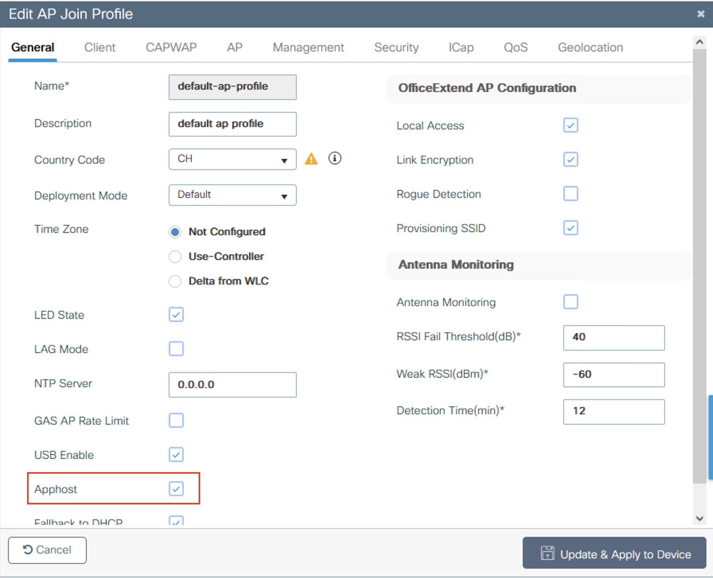

# Prerequisites
1. [Download the ioxclient](https://developer.cisco.com/docs/iox/#!iox-resource-downloads)
The tool ioxclient is required to convert docker image to the proper format for Catalyst APs. 
2. Install Docker (see details based on your OS)

# Step by Step Guide
## Set up you infrastrcture
Before installation check that IOx feature is enabled on C9800.


## Containerize the Application
1. Download or clone this GitHub repository to your local machine.
2. Navigate to the directory containing the Dockerfile and run:
   ```
   docker build -t web-ap-app .
   ```
3. Once the docker image is created, use `ioxclient` to create the package file:
    ```
    ioxclient docker package -p ext2 web-ap-app ./conf
    ```

   Check if successfully has been created:
   ```
   ls -lr
   ```
6. Select installation tool and deploy the app. In section below you find details for Cisco Catalyst Center and ioxclient

Note: Packages of sample app are available in the package directory

## Option 1: Install via Catalyst Center
1. In Catalyst Center, open Provision > Services > IoT Services.
2. Click "New App" and upload the package.tar file.
3. Click on the uploaded app dash, select Install and follow the wizard

Note: In hierarchy you need to go to floor level to see available APs

## Option 2: Install via ioxclient
1. Configure an `ioxclient` profile and deploy the app based on the instructions [here](https://developer.cisco.com/docs/app-hosting-ap/#!deploy-iox-application-on-ap-using-ioxclient/activate-the-iox-application-on-ap).
    ```
    ioxclient profiles create
    ```
    To verify the active profile, use `ioxclient profiles list`.

2.  Install the application using the command.
    ```
    ioxclient app install CLEUAPP package.tar
    ```
3.  To activate the app use:
    ```
    ioxclient app activate CLEUAPP --payload activation.json
    ``` 
4.  Now, start the app
    ```
    ioxclient app start CLEUAPP
    ``` 

After deployment use `ioxclient app info CLEUAPP` to validate configuration

**Stop and Remove app**

1. Stop, remove and uninstall the app:
   ```iox
    ioxclient app stop CLEUAPP
    ioxclient app deactivate CLEUAPP
    ioxclient app uninstall CLEUAPP
   ```

**Verify and Test the app (from the AP itself)**
1. To Verify the app status, use:
    ```iox
    sh iox applications
    ```

2. Connect to the app
    ```iox
    connect iox application
    ```
