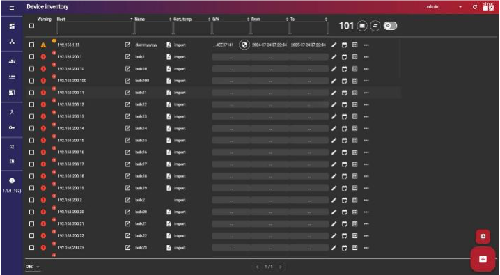

# Certificate Auto Enrollment
Maintaining certificates for network endpoints is a common challenge we face in production networks. Simultaneously, these network endpoints are part of the network edge. This repository contains a solution for this challenge using Cisco Application hosting and a software app called Certificate Auto-enrollment Security System and Integration Enhancement (CASSIE). Using this combination, we can effectively control the certificate lifecycle regardless of the network domain.
## What is CASSIE?
* Automated certificate lifecycle management for non-PC devices
(e.g., IP Cameras, Printers, production IoT elements, medical equipment, network components)
* Enables full use of 802.1X authentication in enterprise networks without manual certificate handling
* Scalable, modular, based on standard protocols
* Smart onboarding and device detection

For more infor check this [link](https://www.simac.cz/en/solutions-and-services/digital-transformation/cassie)

## Install via Catalyst Center
1. The same approach as described in section [Catalyst-9300-APP](/Catalyst-9300-APP/README.md). 

## Install via CLI
1. The same approach as described section [Catalyst-9300-APP](/Catalyst-9300-APP/README.md). 

