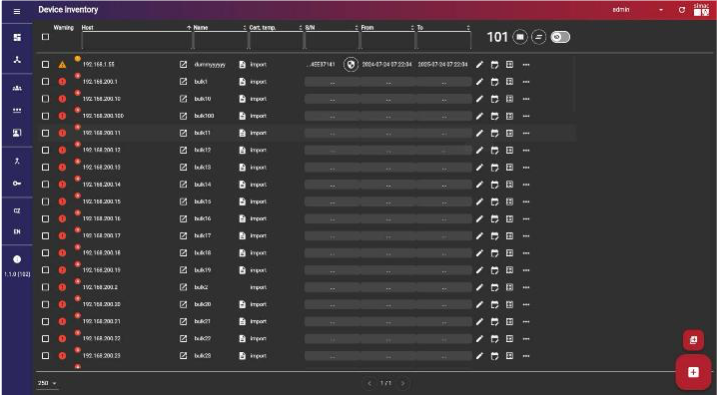

# Certificate Auto Enrollment
Maintaining certificates for network endpoints is a common challenge we face in production networks. Simultaneously, these network endpoints are part of the network edge. This repository contains a solution for this challenge using Cisco Application hosting and a software app called Certificate Auto-enrollment Security System and Integration Enhancement (CASSIE). Using this combination, we can effectively control the certificate lifecycle regardless of the network domain.

## Table of Contents

- [What is CASSIE?](#what-is-cassie)
- [Deployment](#deployment)
  - [Catalyst Center](#catalyst-center)
  - [CLI](#cli)
- [Useful Resources](#useful-resources)

## What is CASSIE?
* Automated certificate lifecycle management for non-PC devices
(e.g., IP Cameras, Printers, production IoT elements, medical equipment, network components)
* Enables full use of 802.1X authentication in enterprise networks without manual certificate handling
* Scalable, modular, based on standard protocols
* Smart onboarding and device detection

For more information, check this [link](https://www.simac.cz/en/solutions-and-services/digital-transformation/cassie)

## Deployment

### Catalyst Center
1. The same approach as described in section [Catalyst-9300-APP](/Catalyst-9300-APP/README.md#option-1-install-via-catalyst-center). 
2. Confirm the CASSIE package is ready and the app network can reach DNS/NTP and CA/PKI endpoints.
3. After deployment, verify the app status is `RUNNING` and validate certificate enrollment with a test endpoint.

### CLI
1. The same approach as described in section [Catalyst-9300-APP](/Catalyst-9300-APP/README.md#option-2-install-via-cli). 
2. Place the CASSIE package in reachable switch storage (for example, `usbflash1:`) and apply app networking for CA/PKI reachability.
3. Validate with `show app-hosting list` and `show app-hosting detail appid <app-id>`, then confirm certificate enrollment.

## Useful Resources
- [CASSIE Overview](https://www.simac.cz/en/solutions-and-services/digital-transformation/cassie)
- [Cisco Application Hosting Guide](https://developer.cisco.com/docs/app-hosting/introduction/)
- [Catalyst 9300 App Hosting Sample](../Catalyst-9300-APP/README.md)

