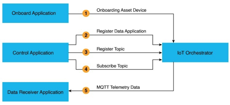
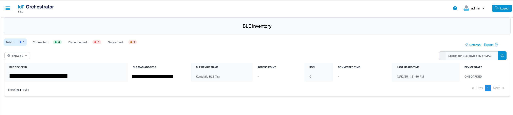
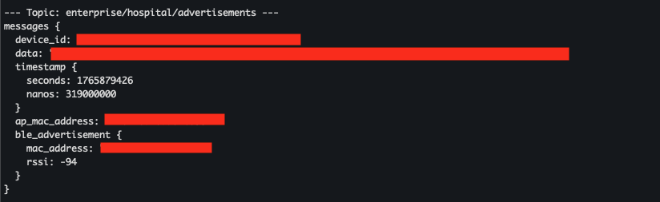

# IoT Orchestrator Asset Tracking Example
Cisco Spaces Connect for IoT Services solution enables delivery of advanced BLE capabilities over Cisco Catalyst Wireless infrastructure. 

## Prerequisite
Follow the complete [IoT Orchestrator Configuration Guide](https://www.cisco.com/c/dam/en/us/td/docs/wireless/spaces/iot-orchestrator/qsg/spaces-connect-iot-qsg.pdf) to set up the IoT Orchestrator on your 9800 Controller. 

Make sure that you uploaded the `server.key` and the certificate and that you have created the application keys in the IoT Orchestrator GUI.

This example specifically walks you through the process of:

1. Onboarding a BLE sensor.
2. Registering a data receiver application to consume sensor data.
3. Registering a topic to specify the type of BLE data to receive.
4. Subscribing to the MQTT topic to retrieve the BLE beacon advertisements.
5. Finally, the data Reiver Application will receive the MQTT data. \


> *Note*: The Onboard Application, Control Application, and Data Receiver Application are three separate components. The Onboard Application handles device registration and authentication, the Control Application manages commands and control messages to the devices, and the Data Receiver Application collects and processes data from the sensors. In this example, we use a simplified setup where all three components are configured from a single Linux machine.

## Supported BLE beacon formats

The provided Python decoder supports standard **BLE advertisement** formats and is vendor independent.

Supported formats:
- **iBeacon** 
Any BLE tag advertising iBeacon data. UUID, major, minor and TX power are decoded  

- **Eddystone UID** 
Any BLE tag advertising Eddystone UID. Namespace ID, instance ID and TX power are decoded  

- **Eddystone URL**
Any BLE tag advertising Eddystone URL. TX power is decoded, URL payload is shown as raw data  

*Limitations*:
Vendor specific proprietary formats are not decoded  
Kontakt.io or other tags are supported only when configured to advertise iBeacon or Eddystone

> *Note*: Some sensors send their measurements via **GATT notifications** rather than standard BLE advertisements, so these values may not appear in the parsed advertisement data. The IoT Orchestrator supports forwarding both BLE advertisements and GATT notifications, but this Python decoder only parses advertisement payloads. Data sent via GATT notifications will not be decoded by this script.

## Variables
Please make sure you replace the placeholder variables below with values specific to your network and IoT Orchestrator setup.

| Placeholder | Description | Example |
|------------|------------|---------|
| `IOT_IP` | IP address of the IoT Orchestrator application | `192.168.104.10` |
| `BLE_NAME` | Any name in string format that represents the BLE sensor | `BLE Monitor` |
| `MAC_ADDRESS` | MAC address of the BLE sensor | `F6:04:FB:B0:92:2D` |
| `ONBOARD_APP_ID` | Onboarding application ID from the IoT Orchestrator GUI* | `onboardApplication` |
| `CONTROL_APP_ID` | Control application ID from the IoT Orchestrator GUI* | `controlApplication` |
| `DATA_APP_ID` | Data application ID from the IoT Orchestrator GUI* | `dataApplication` |
| `ONBOARD_APP_KEY` | Onboarding application key from the IoT Orchestrator GUI* | |
| `CONTROL_APP_KEY` | Control application key from the IoT Orchestrator GUI* | |
| `DATA_APP_KEY` | Data application key from the IoT Orchestrator GUI* | |
| `MQTT_TOPIC_NAME` | Any name, used as MQTT topic for publishing data | `enterprise/hospital/advertisements` |
| `BLE_DEVICE_ID` | BLE device ID assigned after sensor registration** | `57f85940-ea8e-405f-bc06-b744141db08c` |

*) Under *Administration > App Registration > Show Registered Apps*\

**) Under *Inventory > BLE Client*


## Steps
Before you start, you can store all values as environment variables in your terminal:
```bash
export IOT_IP=
export BLE_NAME=
export MAC_ADDRESS=
export ONBOARD_APP_ID=
export CONTROL_APP_ID=
export DATA_APP_ID=
export ONBOARD_APP_KEY=
export CONTROL_APP_KEY=
export DATA_APP_KEY=
export MQTT_TOPIC_NAME=
```
### 1. Onboard Sensors
In the first step, the BLE Device has to be onboarded in the IoT Orchestrator. To do so, run the following API Call:
```bash
curl -k --location "https://$IOT_IP:8081/scim/v2/Devices" \
--header "x-api-key: $ONBOARD_APP_KEY" \
--header "Content-Type: application/json" \
--data '{
  "schemas": [
    "urn:ietf:params:scim:schemas:core:2.0:Device",
    "urn:ietf:params:scim:schemas:extension:ble:2.0:Device",
    "urn:ietf:params:scim:schemas:extension:endpointapps:2.0:Device"
  ],
  "deviceDisplayName": "'"$BLE_NAME"'",
  "adminState": true,
  "urn:ietf:params:scim:schemas:extension:ble:2.0:Device": {
    "versionSupport": [
      "5.3"
    ],
    "deviceMacAddress": "'"$MAC_ADDRESS"'",
    "isRandom": false,
    "mobility": false,
    "pairingMethods": [
      "urn:ietf:params:scim:schemas:extension:pairingNull:2.0:Device",
      "urn:ietf:params:scim:schemas:extension:pairingJustWorks:2.0:Device"
    ],
    "urn:ietf:params:scim:schemas:extension:pairingNull:2.0:Device": null,
    "urn:ietf:params:scim:schemas:extension:pairingJustWorks:2.0:Device": {
      "key": null
    }
  },
  "urn:ietf:params:scim:schemas:extension:endpointAppsExt:2.0:Device": {
    "onboardingUrl": "'"$ONBOARD_APP_ID"'",
    "deviceControlUrl": [
      "'"$CONTROL_APP_ID"'"
    ],
    "dataReceiverUrl": []
  }
}'
```
Now, you can log in to your IoT Orchestrator dashboard, and under *Inventory > BLE Client* copy the BLE device id and save it as enivornment variable. 
```bash
export BLE_DEVICE_ID=
```

We are using the **SCIM API** to onboard the BLE devices. Refer to the [SCIM API Reference](https://developer.cisco.com/docs/spaces-connect-for-iot-services/onboard-operations-apis-overview/) or [Onboarding BLE Devices Using SCIM](https://developer.cisco.com/docs/spaces-connect-for-iot-services/onboarding-ble-devices-using-scim/) for more information.

### 2. Register the Data Receiver Application
Now, the data receiver application has to be registered to consume the sensor data.
```bash
curl -k --location "https://$IOT_IP:8081/control/registration/registerDataApp" \
--header "Content-Type: application/json" \
--header "x-api-key: $CONTROL_APP_KEY" \
--data '{
  "controlApp": "'"$CONTROL_APP_ID"'",
  "topic": "'"$MQTT_TOPIC_NAME"'",
  "dataApps": [
    {
      "dataAppID": "'"$DATA_APP_ID"'"
    }
  ]
}'
```
All control operations for BLE devices rely on the **NIPC API**. Please refer to [NIPC API Reference](https://developer.cisco.com/docs/spaces-connect-for-iot-services/control-operations-apis-overview/) or [Control Operations on BLE Devices](https://developer.cisco.com/docs/spaces-connect-for-iot-services/control-operations-on-ble-devices/).

### 3. Register Topic
As next, registering a MQTT topic to specify the type of BLE data to receive.
```bash
curl -k --location "https://$IOT_IP:8081/control/registration/registerTopic" \
--header "x-api-key: $CONTROL_APP_KEY" \
--header "Content-Type: application/json" \
--data '{
  "technology": "ble",
  "topic": "'"$MQTT_TOPIC_NAME"'",
  "ids": [
    "'"$BLE_DEVICE_ID"'"
  ],
  "controlApp": "'"$CONTROL_APP_ID"'",
  "ble": {
    "type": "advertisements"
  }
}'
```

### 4. Subscribing to the MQTT topic
Once your BLE sensor is onboarded, data receiver application registered, and topic configured, you can subscribe to the MQTT topic to start receiving real-time BLE advertisement data. 

With the basic command you will receive raw, encrypted data. 
```bash
mosquitto_sub -h $IOT_IP -p 41883 \
-t "$MQTT_TOPIC_NAME" \
-u "$DATA_APP_ID" \
--pw "$DATA_APP_KEY"
```
To subscribe to all topics, use `mosquitto_sub -h [[IoT-IP]] -p 41883 -u '[[DATA APP ID]]' --pw '[[DATA APP KEY]]' -t '#' -v` instead. Refer to [Subscribing to Advertisements and Notifications](https://developer.cisco.com/docs/spaces-connect-for-iot-services/subscribing-to-advertisements-and-notifications/) for more information.

#### Subscribe to the MQTT topic and decrypt the message 
The data received from the IoT Orchestrator is encoded using Google Protocol Buffers (`Protobuf`). To make this data human-readable, you need to decode it using the provided .proto schema.

1. Copy the content of the `data_app.proto` file from [here](https://github.com/ietf-wg-asdf/asdf-nipc/blob/cisco-iot-orchestrator-1.1/proto/data_app.proto) and save it locally.
```bash
mkdir iot_decoder
cd iot_decoder
# place the data_app.proto file here
```
It is recommended to also download the `timestamp.proto` file from [here](https://github.com/protocolbuffers/protobuf/blob/main/src/google/protobuf/timestamp.proto). Copy the file and create a dedicated folder inside `iot_decoder`:

  ```bash
  mkdir -p google/protobuf
  cd google/protobuf
  # place the timestamp.proto file here, then navigate back
  cd ../..
  ```

2. Verify the installation of the `protoc` compiler and the `xxd` utility, and install them if missing.
  ```bash
  protoc --version
  which xxd
  ```

3. After that, you can receive and decode the messages using the following command;
  ```bash
  mosquitto_sub -h $IOT_IP -p 41883 \
  -t "$MQTT_TOPIC_NAME" \
  -u "$DATA_APP_ID" \
  --pw "$DATA_APP_KEY" \
  -F "%t %x" | \
  while IFS=' ' read -r topic hex_payload; do
      if [ -z "$hex_payload" ]; then
          continue
      fi

      echo "--- Topic: $topic ---"
      echo "$hex_payload" | xxd -r -p | protoc --experimental_allow_proto3_optional --decode=nipc.DataBatch -I. data_app.proto
      echo "--------------------------------------------"
  done
  ```


#### Subscribe to the MQTT topic and decrypt the message including the BLE data (Using a Python script)
With the command above we receive the unencrypted message, but the data is still in hex format. To encrypt the entire data packet, use the provided Python script. 
1. Copy the content of the `data_app.proto` file from [here](https://github.com/ietf-wg-asdf/asdf-nipc/blob/cisco-iot-orchestrator-1.1/proto/data_app.proto) and save it locally.
```bash
  mkdir iot_decoder
  cd iot_decoder
  # place the data_app.proto file here
```
It is recommended to also download the `timestamp.proto` file from [here](https://github.com/protocolbuffers/protobuf/blob/main/src/google/protobuf/timestamp.proto). Copy the file and create a dedicated folder inside `iot_decoder`:

  ```bash
  mkdir -p google/protobuf
  cd google/protobuf
  # place the timestamp.proto file here, then navigagte back
  cd ../..
  ```

2. Run the command to generate the `data_app_pb2.py` file in the `iot_decoder` folder.
  ```bash
  protoc --proto_path=. --python_out=. --experimental_allow_proto3_optional data_app.proto
  ```
3. Copy the content of `decode_mqtt_stream.py` (from this Github repo) and save it in the `iot_decoder` folder.
  ```bash
  touch decode_mqtt_stream.py 
  ```
4. Now install `protobuf` libarary 
  ```
  pip install protobuf
  ```
5. Subscribe to the topic 
  ```bash
  mosquitto_sub -h $IOT_IP -p 41883 \
  -t "$MQTT_TOPIC_NAME" \
  -u "$DATA_APP_ID" \
  --pw "$DATA_APP_KEY" \
  -F "%t %x" | python3 decode_mqtt_stream.py
  ```
\
In our example, a BLE beacon was detected on December 16, 2025. The beacon broadcasts as an iBeacon, with a major value 88, minor value 888, and transmit power -77.
The signal strength (RSSI) at the time of detection was -92 dBm, indicating a weak or distant signal.

### 5. Consume the data!