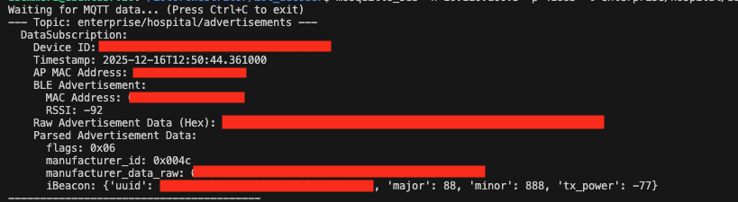

# IoT Orchestrator Asset Tracking Example
Cisco Spaces Connect for IoT Services solution enables delivery of advanced BLE capabilities over Cisco Catalyst Wireless infrastructure. 

## Prerequisite
Follow the complete [IoT Orchestrator Configuration Guide](https://www.cisco.com/c/dam/en/us/td/docs/wireless/spaces/iot-orchestrator/qsg/spaces-connect-iot-qsg.pdf) to set up the IoT Orchestrator on your 9800 Controller. 

Make sure that you uploaded the `server.key` and the certificate and that you have created the application keys in the IoT Orchestrator GUI.

This example specifically walks you through the process of:
1. Onboarding a BLE sensor.
2. Registering a data receiver application to consume sensor data.
3. Registering a topic to specify the type of BLE data to receive.
4. Subscribing to the MQTT topic to retrieve the BLE beacon advertisements.
5. Finally, the data Reiver Application will receive the MQTT data. \


## Variables
Please make sure you replace the placeholder variables below with values specific to your network and IoT Orchestrator setup.

| Placeholder | Description | Example |
|------------|------------|---------|
| `[[IoT-IP]]` | IP address of the IoT Orchestrator application | `192.168.104.10` |
| `[[BLE NAME]]` | Any name in string format that represents the BLE sensor | `BLE Monitor` |
| `[[MAC ADDRESS]]` | MAC address of the BLE sensor | `F6:04:FB:B0:92:2D` |
| `[[ONBOARD APP ID]]` | Onboarding application ID from the IoT Orchestrator GUI* | `onboardApplication` |
| `[[CONTROL APP ID]]` | Control application ID from the IoT Orchestrator GUI* | `controlApplication` |
| `[[DATA APP ID]]` | Data application ID from the IoT Orchestrator GUI* | `dataApplication` |
| `[[ONBOARD APP KEY]]` | Onboarding application key from the IoT Orchestrator GUI* | |
| `[[CONTROL APP KEY]]` | Control application key from the IoT Orchestrator GUI* | |
| `[[DATA APP KEY]]` | Data application key from the IoT Orchestrator GUI* | |
| `[[MQTT TOPIC NAME]]` | Any name, used as MQTT topic for publishing data | `enterprise/hospital/advertisements` |
| `[[BLE DEVICE ID]]` | BLE device ID assigned after sensor registration** | `57f85940-ea8e-405f-bc06-b744141db08c` |

*) Under *Administration > App Registration > Show Registered Apps*\

**) Under *Inventory > BLE Client*


## Steps

### 1. Onboard Sensors
```bash
curl -k --location 'https://[[IoT-IP]]:8081/scim/v2/Devices' \
--header 'x-api-key: [[ONBOARD APP KEY]]' \
--header 'Content-Type: application/json' \
--data '{
  "schemas": [
    "urn:ietf:params:scim:schemas:core:2.0:Device",
    "urn:ietf:params:scim:schemas:extension:ble:2.0:Device",
    "urn:ietf:params:scim:schemas:extension:endpointapps:2.0:Device"
  ],
  "deviceDisplayName": "[[BLE NAME]]",
  "adminState": true,
  "urn:ietf:params:scim:schemas:extension:ble:2.0:Device": {
    "versionSupport": [
      "5.3"
    ],
    "deviceMacAddress": "[[MAC ADDRESS]]",
    "isRandom": false,
    "mobility": false,
    "pairingMethods": [
      "urn:ietf:params:scim:schemas:extension:pairingNull:2.0:Device",
      "urn:ietf:params:scim:schemas:extension:pairingJustWorks:2.0:Device"
    ],
    "urn:ietf:params:scim:schemas:extension:pairingNull:2.0:Device": null,
    "urn:ietf:params:scim:schemas:extension:pairingJustWorks:2.0:Device": {
      "key": null
    }
  },
  "urn:ietf:params:scim:schemas:extension:endpointAppsExt:2.0:Device": {
    "onboardingUrl": "[[ONBOARD APP ID]]",
    "deviceControlUrl": [
      "[[CONTROL APP ID]]"
    ],
    "dataReceiverUrl": []
  }
}'
```
We are using the **SCIM API** to onboard the BLE devices. Refer to the [SCIM API Reference](https://developer.cisco.com/docs/spaces-connect-for-iot-services/onboard-operations-apis-overview/) or [Onboarding BLE Devices Using SCIM](https://developer.cisco.com/docs/spaces-connect-for-iot-services/onboarding-ble-devices-using-scim/) for more information.

### 2. Register the Data Receiver Application
```bash
curl -k --location 'https://[[IoT-IP]]:8081/control/registration/registerDataApp' \
--header 'Content-Type: application/json' \
--header 'x-api-key: [[CONTROL APP KEY]]' \
--data '
{
"controlApp": "[[CONTROL APP ID]]",
"topic": "[[MQTT TOPIC NAME]]",
"dataApps": [
{
"dataAppID": "[[DATA APP ID]]"
}
]
}'
```
All control operations for BLE devices rely on the **NIPC API**. Please refer to [NIPC API Reference](https://developer.cisco.com/docs/spaces-connect-for-iot-services/control-operations-apis-overview/) or [Control Operations on BLE Devices](https://developer.cisco.com/docs/spaces-connect-for-iot-services/control-operations-on-ble-devices/).

### 3. Register Topic
```bash
curl -k --location 'https://[[IoT-IP]]:8081/control/registration/registerTopic' \
--header 'x-api-key: [[CONTROL APP KEY]]' \
--header 'Content-Type: application/json' \
--data '
{
"technology": "ble",
"topic": "[[MQTT TOPIC NAME]]",
"ids": [
  "[[BLE DEVICE ID]]"
],
"controlApp": "[[CONTROL APP ID]]",
"ble": {
"type": "advertisements"
}
}'
```

### 4. Subscribing to the MQTT topic
Once your BLE sensor is onboarded, data receiver application registered, and topic configured, you can subscribe to the MQTT topic to start receiving real-time BLE advertisement data. 

With the basic command you will receive raw, encrypted data. 
```bash
mosquitto_sub -h [[IoT-IP]] -p 41883 /
-t '[[MQTT TOPIC NAME]]' /
-u '[[DATA APP ID]]' /
--pw '[[DATA APP KEY]]'
```
To subscribe to all topics, use `mosquitto_sub -h [[IoT-IP]] -p 41883 -u '[[DATA APP ID]]' --pw '[[DATA APP KEY]]' -t '#' -v` insteaed. Refer to [Subscribing to Advertisements and Notifications](https://developer.cisco.com/docs/spaces-connect-for-iot-services/subscribing-to-advertisements-and-notifications/) for more information.

#### Subscribe to the MQTT topic and decrypt the message 
The data received from the IoT Orchestrator is encoded using Google Protocol Buffers (`Protobuf`). To make this data human-readable, you need to decode it using the provided .proto schema.

1. Copy the content of the `data_app.proto` file from [here](https://github.com/ietf-wg-asdf/asdf-nipc/blob/cisco-iot-orchestrator-1.1/proto/data_app.proto) and save it locally.
```bash
mkdir iot_decoder
cd iot_decoder
# place the data_app.proto file here
```
It is recommended to also download the `timestamp.proto` file from [here](https://github.com/protocolbuffers/protobuf/blob/main/src/google/protobuf/timestamp.proto). Copy the file and create a dedicated folder inside `iot_decoder`:

  ```bash
  mkdir -p google/protobuf
  cd google/protobuf
  # place the timestamp.proto file here, then navigate back
  cd ../..
  ```

2. Verify the installation of the protoc compiler and the xxd utility, and install them if missing.
  ```bash
  protoc --version
  which xxd
  ```

3. After that, you can receive and decode the messages using the following command;
  ```bash
  mosquitto_sub -h [[IoT-IP]] -p 41883 /
  -t '[[MQTT TOPIC NAME]]' /
  -u '[[DATA APP ID]]' /
  --pw '[[DATA APP KEY]]' / 
  -F "%t %x" | \
  while IFS=' ' read -r topic hex_payload; do
      if [ -z "$hex_payload" ]; then
          continue
      fi

      echo "--- Topic: $topic ---"
      echo "$hex_payload" | xxd -r -p | protoc --experimental_allow_proto3_optional --decode=nipc.DataBatch -I. data_app.proto
      echo "--------------------------------------------"
  done
  ```


#### Subscribe to the MQTT topic and decrypt the message including the BLE data (Using a Python script)
With the command above we receive the unencrypted message, but the data is still in hex format. To encrypt the entire data packet, use the provided Python script. 
1. Copy the content of the `data_app.proto` file from [here](https://github.com/ietf-wg-asdf/asdf-nipc/blob/cisco-iot-orchestrator-1.1/proto/data_app.proto) and save it locally.
```bash
  mkdir iot_decoder
  cd iot_decoder
  # place the data_app.proto file here
```
It is recommended to also download the `timestamp.proto` file from [here](https://github.com/protocolbuffers/protobuf/blob/main/src/google/protobuf/timestamp.proto). Copy the file and create a dedicated folder inside `iot_decoder`:

  ```bash
  mkdir -p google/protobuf
  cd google/protobuf
  # place the timestamp.proto file here, then navigagte back
  cd ../..
  ```

2. Run the command to generate the `data_app_pb2.py` file in the `iot_decoder` folder.
  ```bash
  protoc --proto_path=. --python_out=. --experimental_allow_proto3_optional data_app.proto
  ```
3. Copy the content of `decode_mqtt_stream.py` (from this Github repo) and save it in the `iot_decoder` folder.
  ```bash
  touch decode_mqtt_stream.py 
  ```
4. Now install `protobuf` libarary 
  ```
  pip install protobuf
  ```
5. Subscribe to the topic 
  ```bash
  mosquitto_sub -h [[IoT-IP]] -p 41883 \
  -t '[[MQTT TOPIC NAME]]' \
  -u 'https://[[DATA APP ID]]' \
  --pw '[[CONTROL APP ID]]' \
  -F "%t %x" | python3 decode_mqtt_stream.py
  ```
\
In our example, a BLE beacon was detected on December 16, 2025. The beacon broadcasts as an iBeacon, with a major value 88, minor value 888, and transmit power -77.
The signal strength (RSSI) at the time of detection was -92 dBm, indicating a weak or distant signal.

### 5. Consume the data!